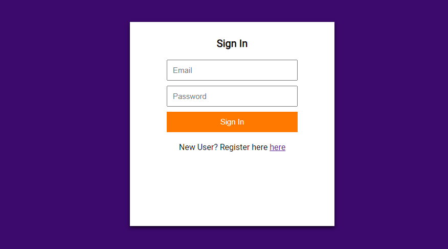
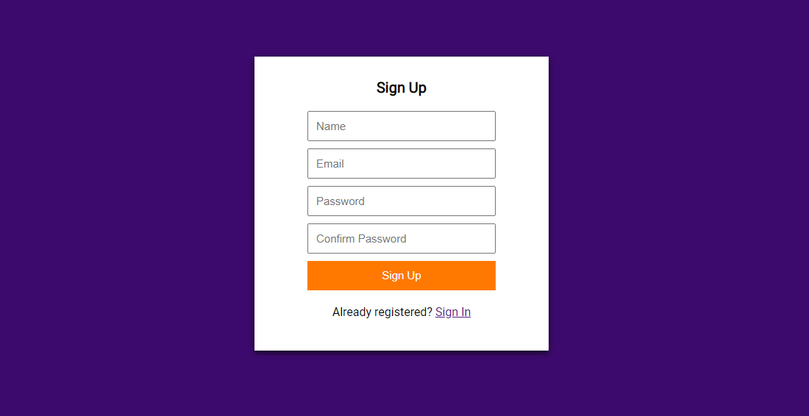
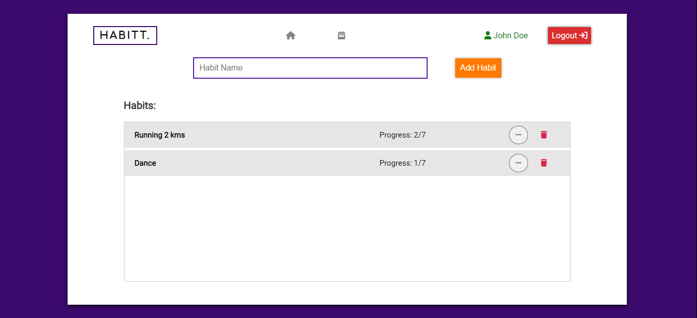
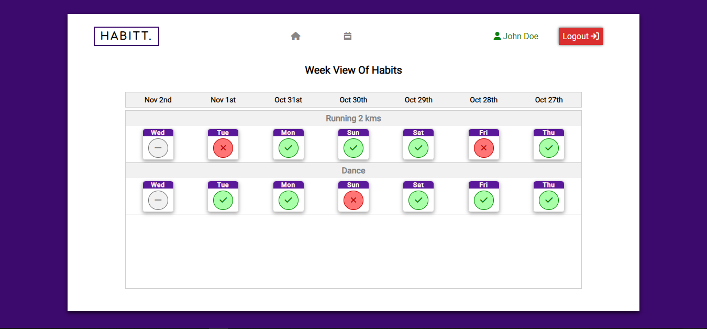
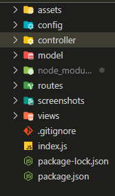

# habit-tracker
- It is a fullstack habit tracker app which allows user to create multiple habits and track them.
- This app is built using `Node.js`, `Express.js`, `MongoDB` and `EJS` template engine which follows `MVC` architecture.

# Sign In and Sign Up page
- Here the user can enter the required details and sign in to the app.
- If the user is not registered then the user should go to the sign up page.
- Here are the screenshots of sign in and sign up page.

# Home page 
- This is the page where user can add a new habit and start tracking it.
- This page lets the user to create multiple habits, change their current day status and delete them as well.
- Here the current day habit has three status - none, done, and not done.
- Also the user can check the progress, I mean how he/she had been performing since last seven days.
- Here is the screenshot of Home page.

# Details Page
- This is the page where user can see the performance of last seven days and change them as well.
- Here is a screenshot of details page.

# Folder Structure

# Steps to run this project on your local system.
- Clone the project.
- Open the project in VS code and run `npm install` on the terminal to get all the dependencies installed.
- Last and final step is to run the project using `npm start` command.
